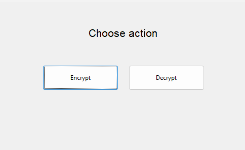
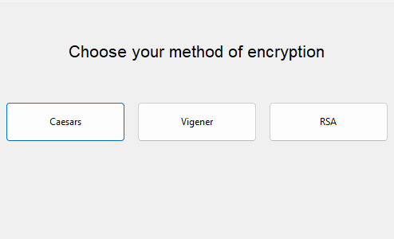
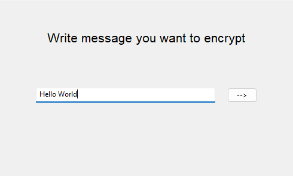
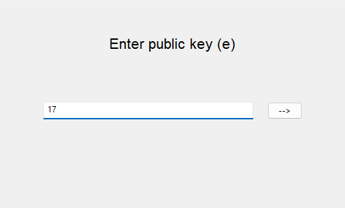
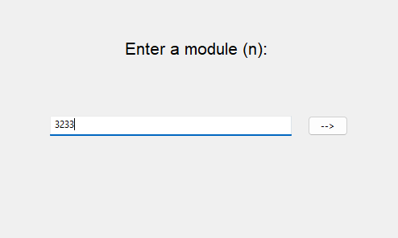
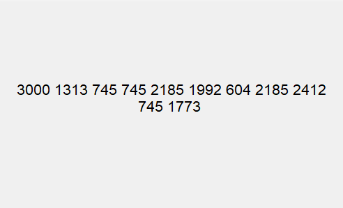

<!-- Improved compatibility of back to top link: See: https://github.com/othneildrew/Best-README-Template/pull/73 -->
<a id="readme-top"></a>
<!--
*** Thanks for checking out the Best-README-Template. If you have a suggestion
*** that would make this better, please fork the repo and create a pull request
*** or simply open an issue with the tag "enhancement".
*** Don't forget to give the project a star!
*** Thanks again! Now go create something AMAZING! :D
-->


<!-- PROJECT SHIELDS -->
<!--
*** I'm using markdown "reference style" links for readability.
*** Reference links are enclosed in brackets [ ] instead of parentheses ( ).
*** See the bottom of this document for the declaration of the reference variables
*** for contributors-url, forks-url, etc. This is an optional, concise syntax you may use.
*** https://www.markdownguide.org/basic-syntax/#reference-style-links
-->

<!-- PROJECT LOGO
<br />
<div align="center">
  <a href="https://github.com/0gfn0/EnDeCryptor">
    
 </a>
-->
<h3 align="center">EnDeCryptor</h3>
  <p align="center">
    EnDeCryptor It is a simple encoder and decoder that supports 3 encryption options: Caesar cipher, Vigener cipher, and public key (RSA).
</div>


<!-- TABLE OF CONTENTS -->
<details>
  <summary>Table of Contents</summary>
  <ol>
    <li>
      <a href="#about-the-project">About The Project</a>
    </li>
    <li>
      <a href="#getting-started">Getting Started</a>
      <ul>
        <li><a href="#prerequisites">Prerequisites</a></li>
        <li><a href="#installation">Installation</a></li>
      </ul>
    </li>
    <li><a href="#usage">Usage</a></li>
    <li><a href="#roadmap">Roadmap</a></li>
  </ol>
</details>

<!-- ABOUT THE PROJECT -->
## About The Project
<div align="center">
  
</div>
EnDecrypter supports 3 encryption options: Caesar cipher, Vigener cipher, and public key (RSA).

<p align="right">(<a href="#readme-top">back to top</a>)</p>

<!-- GETTING STARTED -->
## Getting Started

To get a local copy up and running app follow these simple example steps.

### Installation

1. Download a newest version of wxWidgets at [wxWidgets](https://www.wxwidgets.org/downloads/)
2. Download and install newest version of CMake at [CMake](https://cmake.org/download/)
3. Clone the repo
   ```sh
   git clone https://github.com/0gfn0/EnDeCryptor.git
   ```
4. Unzip wxWidgets in path .../EnDeCryptor/External/wxWidgets
5. Open cmd at folder .../EnDeCryptor and create build folder
   ```sh
   .../EnDeCryptor> mkdir build
   ```
6. Go to the build folder
   ```sh
   .../EnDeCryptor> cd build
   ```
7. Run cmake file
   ```sh
   .../EnDeCryptor/build> cmake ..
   ```
8. After a successful assembly, run the project build
   ```sh
   .../EnDeCryptor/build> cmake --build .
   ```
9. Now you can find the EnDeCryptor.exe file along the path
   ```sh
   .../EnDeCryptor/build/debug
   ```

<p align="right">(<a href="#readme-top">back to top</a>)</p>

<!-- USAGE EXAMPLES -->
## Usage!

You can encrypt and decrypt by 3 various cipher. Let's see how to encrypt a message using a public key.
1. Open EnDeCryptor.exe. 
<div align="center">
    
</div>
2. Choose and press Encrypt button, you will see all posible methods of encryption, press RSA button.
<div align="center">
    
</div>
3. Type the message you want to encrypt. 
<div align="center">
    
</div>
4. Enter the part of the public key (e - open exp), it must be a prime number. For example e = 17. 
<div align="center">
    
</div>
5. Enter the part of the public key (n - module). For example n = 3233.
<div align="center">
    
</div>
6. Now you get encrypted message.
<div align="center">
    
</div>

<p align="right">(<a href="#readme-top">back to top</a>)</p>


<!-- ROADMAP -->
## Roadmap

- [ ] Support output and input files
- [ ] More variable cipher

<p align="right">(<a href="#readme-top">back to top</a>)</p>


